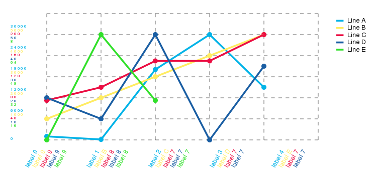

node-mithril-linechart
======================

A simple SVG line chart component for Mithril and NodeJS.

Usage
=====
Add `linechart` to your dependencies on `package.json` file then:

    const linechart = require("linechart");
    const model = {
        "lines": [
            {
                "color": "#ff33ee",
                "data": [
                    {
                        "label": "Sample label",
                        "value": 100,
                        "tooltip": "More details"
                    },
                    ...
                ]
            },
            {
                "color": "#2233ee",
                "data": [
                    {
                        "label": "Some label",
                        "value": 130,
                        "tooltip": "More details"
                    },
                    ...
                ]
            },
            ...
        ]
    };
    const ctrl = linechart.controller(model);
    const view = linechart.view(ctrl);

Options
=======

TODO: Options

Test
====

Setup [mithril-component-tools](https://github.com/mithril-components/mitthril-components-tools) first. Then:

    npm install
    mct test pagination.js en

